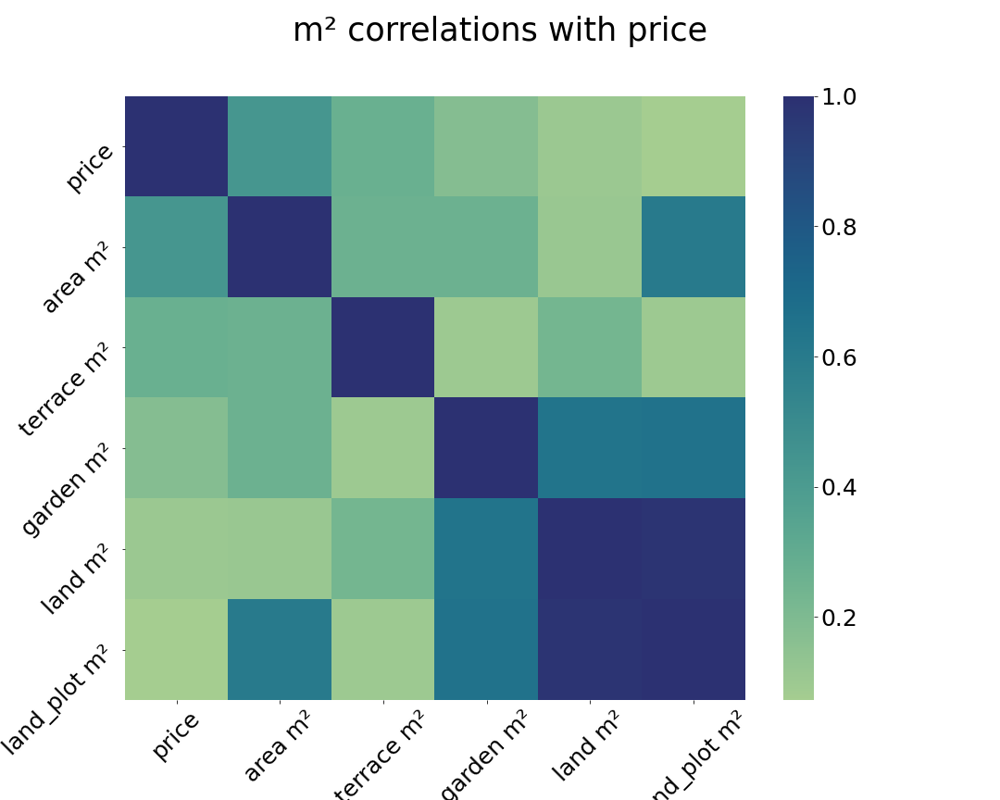

# Data Visualization : Real Estate data For ImmoEliza  
[(Back to top)](#top)


## Table of contents 
[(Back to top)](#table-of-contents)


- [Data Vizualisation](#project-title)
- [Table of contents](#table-of-contents)
- [Introduction](#introduction)
- [Challenge](#challenge)
- [The Team](#team)
- [Development](#development)
   - Data Cleaning
   - Data Analysis
   - Data Interpretention
- [Process](#process)
- [Contribute](#contribute)
    - [Sponsor](#sponsor)
    - [Adding new features or fixing bugs](#adding-new-features-or-fixing-bugs)
- [License](#license)
- [Footer](#footer)


## Introduction
[(Back to top)](#introduction)
The real estate company "ImmoEliza" wants to create a machine learning model to predict prices on Belgium's sales. A complete analysis and interpretation of the dataset need to be provided.

## Challenge   
[(Back to top)](#challenge)

1. Be able to ***```use pandas```***   

1. Be able to ```use Data visualisation libraries```  ***``Matplotlib or Seaborn``***    

1. Be able to ``establish conclusions about a dataset``.

1. ***``Give Insights``*** to our Customer.

## The Team

+ Project Manager:
    + **Emre**

+ Collaborators:
    + **Philippe**
    + **Sravanti**
    + **Didier**

## Development

### 1. Step 1 : Data Cleaning

The dataset was cleaned as below for further analysis.

    Duplicates      ==> removed
    blank spaces    ==> values trimmed
    errors          ==> value's type evaluated and changed
    empty values    ==> when need change pby np.NaN

### 2. Step 2 : Data Analysis

Hereby follow some previous questions we was clarified by the main results from the preliminary data analysis:

+ The target variable is the price 
+ The dataframe has X rows and Y columns
+ we choose to trnsform the target variable in float.
+ We added a column "region" for more accurate analysis per region

 (needed to be discussed):

+ Correlation between variable/target (Why?) 
+ Correlation between the variables/variables ? (Why?)
These questions were answered by This correlation graph:

 


+ Which variables have the greatest influence on the target ? 
+ Which variables have the least influence on the target ? 
+ How many qualitative and quantitative variable is there ? 


### 3. Step 3 : Data Interpretation

- According to the Graph below:
  Are there any outliers? If yes, which ones and why? Which variables would you delete and why ? In your opinion, which 5 variables are the most important and why?


- The Second Graph tells us that:

 What are the most expensive municipalities in Belgium? (Average price, median price, price per square meter) What are the most expensive municipalities in Wallonia? (Average price, median price, price per square meter) What are the most expensive municipalities in Flanders? (Average price, median price, price per square meter) What are the less expensive municipalities in Belgium? (Average price, median price, price per square meter) What are the less expensive municipalities in Wallonia? (Average price, median price, price per square meter) What are the less expensive municipalities in Flanders? (Average price, median price, price per square meter) 
 
 ### Presentation
   Presentation is available [here](https://docs.google.com/presentation/d/1wNy2HfNybQMJ20N0doVz2E7TKnExpVXYTFm42aRJbjw/edit#slide=id.p2).

* Prepared simutaneaously using Google Slide presentation. 
* 1 or 2 slides per person
* Duration Time : 5 minutes. **No code** was included in the presentation.
* Lho did the project (Who):

* **Speakers** and **Contributors** : 
    - ***Emre Ozan***
    - ***Didier Ukanda***
    - ***Philippe Fimmers***
    - ***Sravanthi Tarani***

### Development
###
###
|tools and tasks | comments |
| ------------------------------------------ | -------------------------------------- |
| Communication and Management | mainly through live discussion on-site |
| Trello |each person adding independently labels and tasks as well as involving other team members on them |
| Github | Merging datasets from a ***forked repository*** managed by The Project Manager|

Different teams worked on a merged dataset to be used by all the team. 
<<<<<<< HEAD
On the first day (21/10/20) keras team splitted the sources by columns . Each members having a set 7 columns to analyze. After the distribution of tasks was commonly agreed, the Data formatting and values cleaning in one accord by each member.
=======
On the first day (21/10/20) keras team splitted the sources by columns . Each members having a set 7 columns to analyze. After the distribution of tasks was commonly agreed, the Data formatting and values cleaning in one accord by each member.
>>>>>>> upstream/master
